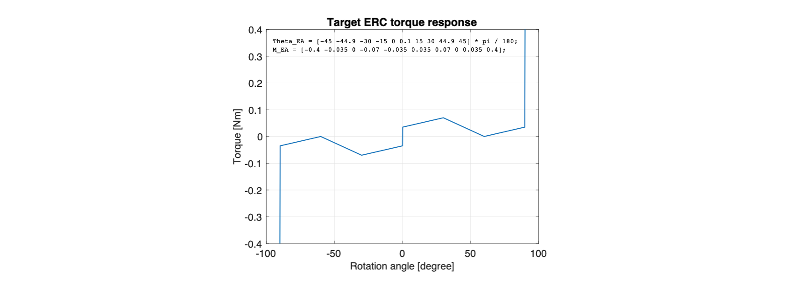

# Elastic Rolling Cam (ERC): Design Guide
**Authors:** Rui Wu, Stefano Mintchev  
*Environmental Robotics Laboratory, ETH Zurich*  
*Email: rui.wu@usys.ethz.ch, stefano.mintchev@usys.ethz.ch*

---

## The ERC Joint
The Elastic Rolling Cam (ERC) is a rotational joint that can replicate an arbitrary rotational stiffness. It comprises a pair of spring-loaded cams. Each cam has an array of spherical teeth that engage with the other cam to prevent slippage between the two cams. When the cams roll against each other, the joint bends, while the variation in spring length and thus the spring-stored elastic energy generates rotational stiffness/torque. The torque response—rotation angle vs. torque—can be "programmed" by designing the cam geometry using our MATLAB program.


---

## Design

### Design Principle
The design input is the torque response that you want the ERC to replicate, parameterized using two vectors: rotation angle vector and torque vector. The only design decision needed is selecting the spring parameters. By choosing appropriate springs, the MATLAB program can generate the ERC geometry to replicate any torque response.


A linear-elastic spring has three independent parameters. Here we use $T_{\text{max}}$, $L_{\text{max}}$, and $\Delta L_{\text{max}}$, which are the spring's maximum tension (N), maximum length (mm), and maximum elongation (mm), as shown below.


According to our study, the spring needs to satisfy two constraints determined from the target response:

```math
\frac{F_{\text{max}} \cdot L_{\text{max}}}{4} \ge \text{SF} \cdot \left|\left(\frac{d\tau}{d\theta}\right)_{\text{min}}\right|
```
```math
\frac{F_{\text{max}} \cdot \Delta L_{\text{max}}}{2} \ge \text{SF} \cdot \Delta U
```
where $\left|\left(\frac{d\tau}{d\theta}\right)_{\text{min}}\right|$ is the maximum torque reduction rate of the desired response (N·m/rad), and $\Delta U$ is the maximum elastic energy variation required by the desired response (J). When multiple springs are used in an ERC, $T_{\text{max}}$ relates to their combined effect. The Safety Factor (SF) has a default value of SF = 2.

Choosing a large Safety Factor reduces torque deviation from the desired response, as shown below (left), where negligible Root Mean Square deviation is achieved at SF = 2. However, a large SF results in an oversized ERC due to proportionality with spring length $L_{\text{max}}$. To balance size and performance, SF = 2 is the default, as supported by simulations with 100,000 randomly-generated target stiffness responses.


Determining the three spring parameters $T_{\text{max}}$, $L_{\text{max}}$, and $\Delta L_{\text{max}}$ with two constraint equations gives the user freedom to decide one parameter, such as using a shorter spring for a smaller ERC, which requires a higher $T_{\text{max}}$.

---

### Design Workflow

With the target response (rotation angle vs. torque curve) defined, follow these steps to determine the spring parameters and generate the cam geometry.

1. Input the target response and SF = 2 into `SpringSelector.m` to determine spring parameters $T_{\text{max}}$, $L_{\text{max}}$, and $\Delta L_{\text{max}}$.
2. Select off-the-shelf tension springs (e.g., from [durovis.ch](https://www.durovis.ch)) that meet the requirements. Calculate $\Delta L_{\text{max}}$ using $\Delta L_{\text{max}} = T_{\text{max}} / k$, where $k$ is the spring constant.
3. Input the spring parameters into `ERCdesigner.m` to generate the cam profile and simulate its torque response. Adjust SF if necessary.
4. Use `ERCmodeller.m` and AutoCAD to generate a 3D printable model. See the modelling workflow below.


## Modelling Workflow


1. Set modelling parameters in `ERCmodeller.m`, then run the script to generate CAD files (`convex.scr` and `concave.scr`).
2. Open AutoCAD, run the generated `.scr` file to automatically build the model.
3. Complete the model by creating a loft body between the "hub" and "head" profiles using "LOFT."
4. Use "SOLID, UNION" to merge bodies and "SOLID, SUBTRACT" to create mounting and pivot holes.

---

## Manufacturing

For accuracy, we recommend using a resin 3D printer (Masked Stereolithography/MSLA), such as the Formlabs Form series or Anycubic Photon Mono series, with a resolution of about 10 microns. A high-toughness resin is preferred for impact tolerance. The setup below uses Anycubic Photon Workshop to hollow the part for weight reduction. Ensure that liquid resin is drained, and lattice infill can add structural stability.


An ERC contains three components: cams, springs, and pins for spring mounting. Bearings can reduce friction-induced hysteresis in torque response by allowing free pin rotation.

---

## Case Study

### Target Response
To design an ERC with the following response (high torque at ±90° for end-stopping):



### Spring Requirement
Input this response and SF = 2 into `SpringSelector.m`, which outputs the required parameters. Assume two springs are used, each requiring $L_{\text{max}} \cdot T_{\text{max}} \ge 0.54 \, \text{N} \cdot \text{m}$ and $\Delta L_{\text{max}} \cdot T_{\text{max}} \ge 0.112 \, \text{N} \cdot \text{m}$.

### Spring Selection
Select a spring from [durovis.ch](https://www.durovis.ch) that meets these specifications (e.g., Type 5/1/1 with $T_{\text{max}} = 18.82 \, \text{N}$, $L_{\text{max}} = 30.27 \, \text{mm}$, $\Delta L_{\text{max}} = 15.87 \, \text{mm}$).

### ERC Design
Input the parameters into `ERCmodeller.m`, generate the cam profile, and verify that the response matches the target.


### ERC Modelling
Follow the modelling workflow to obtain the model.


### Manufacture
3D print the model with a 2 mm wall thickness. M3 bolts are used to mount the springs. The assembly weighs 27 g.

---

## Acknowledgment
This work is funded by the European Union’s Horizon Europe research and innovation programme under the project SPEAR (Grant No. 101119774), the Swiss National Science Foundation (SNSF) under the Eccellenza Grant (Grant No. 186865), and the ETH Zurich Research Grants (Grant No. ETH-15 20-2).
